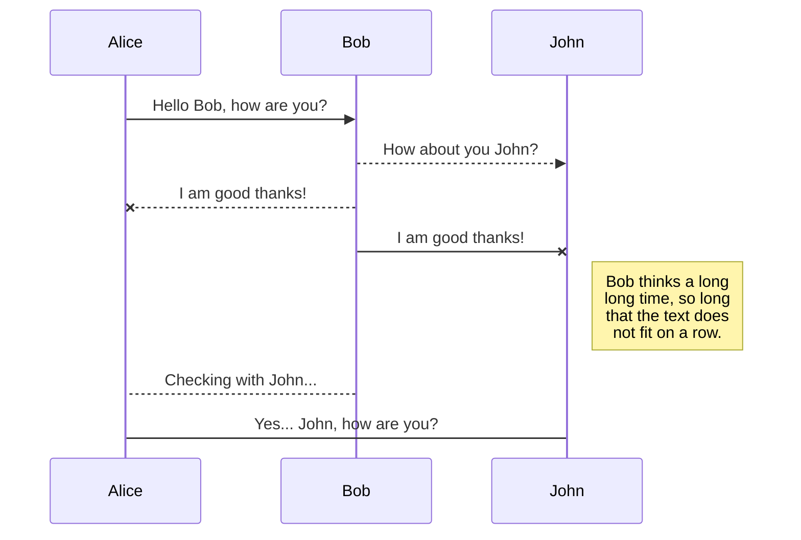
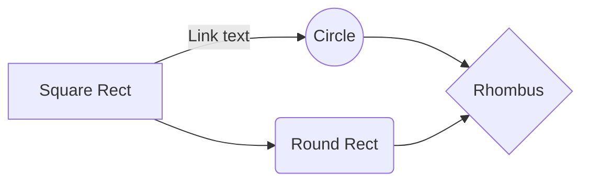

 

## What is InsaneDeals ?

***InsaneDeals*** is an e-commerce project I worked on with Arbor Research. InsaneDeals strives to be the ultimate shopping concierge for prospective customers in a market flooded with different choices.

 

## Business objectives :
> “We bring the coolest bargains on the Internet to your mobile”.

InsaneDeals wants to create an experience that users will love where they can find amazing offers and get customized deals at all major e-commerce stores. The main target market for them is 'price-obsessed' consumers who want great brands at insane prices, aged around 18-30.

 

## Methodology :

Based on the goals and objectives, 'Personalization' will be the key for this design.
 And we may further categorize personalization as:

- *Persona* based Personalization 
- *User Journey* based Personalization
- Individual-Specific Personalization or *Individualization*

Now, we'll go through them one by one in the exploration phase.

 

## Exploration Phase :
### User Personas
I carried out a number of interviews with people from the target audience and discovered three main personas as the first phase of the product design process.

- **Anita** (*University Student - 19yrs*)  
Fashion is her passion, and she wants to stand out in the crowd. As a young adult, she has to save money to buy designer clothes and accessories. Price is a big deal to her.

- **Rahul** (*iOS Developer - 25yrs*) 
He earns an above-average salary. He's super tech-savvy. He always keeps up on the latest technology products. He surfs dozens of sites, looking for the best deals, before finalizing a purchase.

- **Riya** (*Sales Head - 30yrs*) 
She isn’t particularly tech-savvy but uses the internet quite often. She mostly buys online to save time. She preferes to look out for classic and well-known brands for her shopping choices.

 

### User Journey maps
When a project revolves around e-commerce, user experience research must focus on the journey, the customers take in preparing for, during, and after their online shopping experience. But here in this experience, we will be focusing more on the discovery/searching phase. As our product is here to help the user make a decision for their purchase. Based on the personas, I mapped out their hypothetical experiences through user journeys.

And here are the key takeaways from the User journey maps.

- I was able to identify and highlight the user problems.  
- I understood how they interacted with similar platforms  
- I got to know what they expect from a similar platform.  
- I discovered some of their pain points and found out what they experienced at different stages of the shopping experience.  
- I compiled some ideas for solving some of those issues.

 

### Individualization
Even though personas and journey maps helped us reach the goal of personalization, they were all still focused on delivering content to a broad segment of users. If we want to provide tailored deals/offers based on customer's preferences, we can't just bucket them into such broad segments. Therefore, we must go for Individualization, a process that will truly personalize the customer experience in a manner that meets specific consumer expectations by simply personalizing to a single segment.
>But how did we do that?

As part of my collaboration with Arbor Research’s data and development team, I examined how the company would gather the data for individualization so that our content experiences are tailored to a segment of one, customized in real-time based on actions and preferences uniquely related to that individual’s identity.  
  
And the answer was their *machine learning models* and *artificial intelligence (AI) tools*, which helped us to analyze all available content as well as *real-time* and *historical signals* in order to deliver the best deals and offers to each user.

 

## Design Solutions :

After collecting all the insights from the exploration phase, I began designing the platform. I started with as basic as paper sketches, to interactive prototypes throughout this process.

 

## Ecommerce Features :
### Product Card Design

We decided to have these key items in the product card :

- Product name  
- Company name  
- Discounted Price  
- Original Price  
- Discount percentage (Offer)  
- User Rating

We iterated and tested around 8-10 different variants of product card designs, and finally came up with one that can be reused in both the mobile app & the desktop platform.

We added two more items to the card too:

- Source icon (logo of the e-commerce site from where the offer is) 
- A share icon (built-in share icon for each product card) 

 

### Browsing convenience
#### Problem
While testing our prototypes, we realized that the younger segment of our users found browsing through product photos very time-consuming.

#### Solution
We changed the prototype of the product card design by adding a quick-view solution, a simple carousel that could be used to see all of the product's photos without opening it.

 

### Sign up flow

The app leads users to the home page immediately when they install and open it without prompting them to create an account. The platform lets them browse freely.

The users must sign up only if they like the product and want to get the deal. To speed up the process, we used one-tap signups (Google & Facebook).

After signing up, the user has access to more features, such as :

- The ability to set custom alerts
- The option to like a product deal and save it
- Access to exclusive 'Insane Deals'

 

### Referral system experiment

There was a proposal from the clients to implement an 'Insane Token' that would enable users to unlock deals & obtain additional discounts on certain products. And so here is an example of 2 screens for the referral flow between 2 users.

 

### Sitemap & Menu

Divided the whole map into 3 parts
- Shopping  
- Customization  
- Miscellaneous

The homepage and the categories are grouped together. Notifications and settings reside in the customization group. And finally among the miscellaneous are FAQs, Terms and Conditions, Privacy Policies, Contact Info, etc. The IA of the mobile app was derived from this sitemap too.

 

### Configuring Preferences

The app trains itself, whenever a user takes an action within the app. It can be as simple as searching a product, checking details of a product, or maybe a bit complex like moving back and forth between 2 products.
In order to improve the efficiency of the training process for deals suggestions, we need the users to provide some details themselves.

This could have been achieved through a survey; however, rather than making it an extensive and boring process, we proposed an approach that is simpler and quicker to use.

We created an intuitive page that enables users to submit their preferences for shopping categories, brands, etc and hence trains the app to show better deals.

 

>How did we simplify the training process?
 
- We ask users to choose a shopping category.  
- Below the category, we show logos of different brands, which vary from each other (in terms of product style, price range, etc.)  
- We ask the users to choose at least 3 brands from the list.  
- As soon as they select 1 brand, we add a few more brand options (similar to the one they have already selected)  
- This fast forwards the training process and also helps the user to set their preferences  
- Since their choices got saved automatically, they can now go back to the homepage and get fresh new deals.  
- They can even return to this page anytime to add brands or change their preferences.

### Product details page experiment

While designing the product details page, we decided to customize the page for each product, by having a visual continuity throughout the page. Let me show an example.

# Synchronization

Synchronization is one of the biggest features of StackEdit. It enables you to synchronize any file in your workspace with other files stored in your **Google Drive**, your **Dropbox** and your **GitHub** accounts. This allows you to keep writing on other devices, collaborate with people you share the file with, integrate easily into your workflow... The synchronization mechanism takes place every minute in the background, downloading, merging, and uploading file modifications.

There are two types of synchronization and they can complement each other:

- The workspace synchronization will sync all your files, folders and settings automatically. This will allow you to fetch your workspace on any other device.
	> To start syncing your workspace, just sign in with Google in the menu.

- The file synchronization will keep one file of the workspace synced with one or multiple files in **Google Drive**, **Dropbox** or **GitHub**.
	> Before starting to sync files, you must link an account in the **Synchronize** sub-menu.

## Open a file

You can open a file from **Google Drive**, **Dropbox** or **GitHub** by opening the **Synchronize** sub-menu and clicking **Open from**. Once opened in the workspace, any modification in the file will be automatically synced.

## Save a file

You can save any file of the workspace to **Google Drive**, **Dropbox** or **GitHub** by opening the **Synchronize** sub-menu and clicking **Save on**. Even if a file in the workspace is already synced, you can save it to another location. StackEdit can sync one file with multiple locations and accounts.

## Synchronize a file

Once your file is linked to a synchronized location, StackEdit will periodically synchronize it by downloading/uploading any modification. A merge will be performed if necessary and conflicts will be resolved.

If you just have modified your file and you want to force syncing, click the **Synchronize now** button in the navigation bar.

> **Note:** The **Synchronize now** button is disabled if you have no file to synchronize.

## Manage file synchronization

Since one file can be synced with multiple locations, you can list and manage synchronized locations by clicking **File synchronization** in the **Synchronize** sub-menu. This allows you to list and remove synchronized locations that are linked to your file.

# Publication

Publishing in StackEdit makes it simple for you to publish online your files. Once you're happy with a file, you can publish it to different hosting platforms like **Blogger**, **Dropbox**, **Gist**, **GitHub**, **Google Drive**, **WordPress** and **Zendesk**. With [Handlebars templates](http://handlebarsjs.com/), you have full control over what you export.

> Before starting to publish, you must link an account in the **Publish** sub-menu.

## Publish a File

You can publish your file by opening the **Publish** sub-menu and by clicking **Publish to**. For some locations, you can choose between the following formats:

- Markdown: publish the Markdown text on a website that can interpret it (**GitHub** for instance),
- HTML: publish the file converted to HTML via a Handlebars template (on a blog for example).

## Update a publication

After publishing, StackEdit keeps your file linked to that publication which makes it easy for you to re-publish it. Once you have modified your file and you want to update your publication, click on the **Publish now** button in the navigation bar.

> **Note:** The **Publish now** button is disabled if your file has not been published yet.

## Manage file publication

Since one file can be published to multiple locations, you can list and manage publish locations by clicking **File publication** in the **Publish** sub-menu. This allows you to list and remove publication locations that are linked to your file.

# Markdown extensions

StackEdit extends the standard Markdown syntax by adding extra **Markdown extensions**, providing you with some nice features.

> **ProTip:** You can disable any **Markdown extension** in the **File properties** dialog.

## SmartyPants

SmartyPants converts ASCII punctuation characters into "smart" typographic punctuation HTML entities. For example:

|                |ASCII                          |HTML                         |
|----------------|-------------------------------|-----------------------------|
|Single backticks|`'Isn't this fun?'`            |'Isn't this fun?'            |
|Quotes          |`"Isn't this fun?"`            |"Isn't this fun?"            |
|Dashes          |`-- is en-dash, --- is em-dash`|-- is en-dash, --- is em-dash|

## KaTeX

You can render LaTeX mathematical expressions using [KaTeX](https://khan.github.io/KaTeX/):

The *Gamma function* satisfying $\Gamma(n) = (n-1)!\quad\forall n\in\mathbb N$ is via the Euler integral

$$
\Gamma(z) = \int_0^\infty t^{z-1}e^{-t}dt\,.
$$

> You can find more information about **LaTeX** mathematical expressions [here](http://meta.math.stackexchange.com/questions/5020/mathjax-basic-tutorial-and-quick-reference).

## UML diagrams

You can render UML diagrams using [Mermaid](https://mermaidjs.github.io/). For example, this will produce a sequence diagram:

And this will produce a flow chart:

