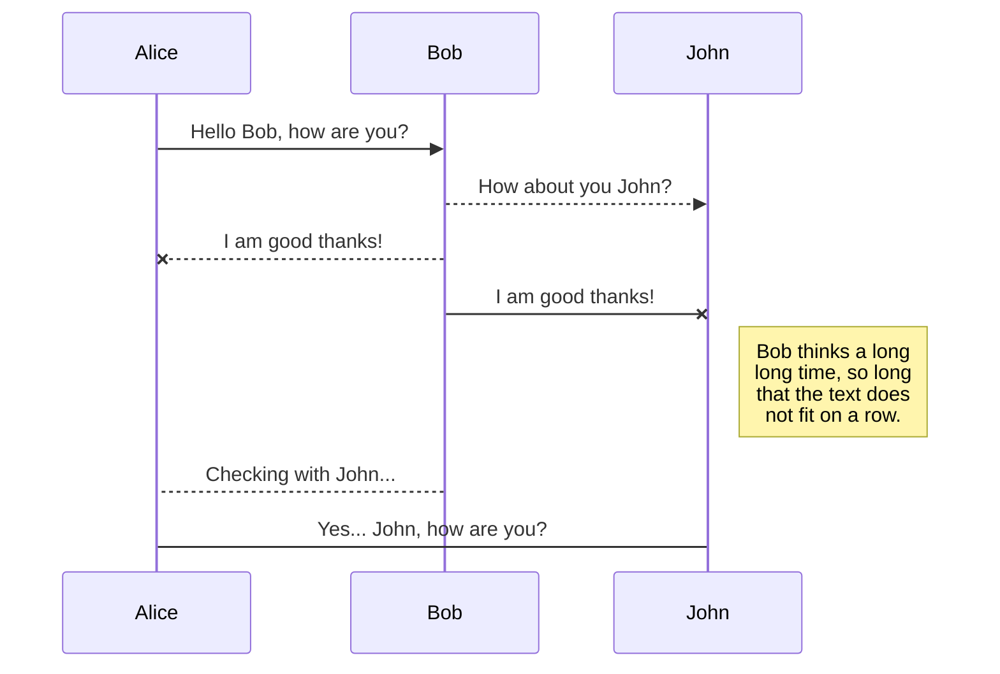
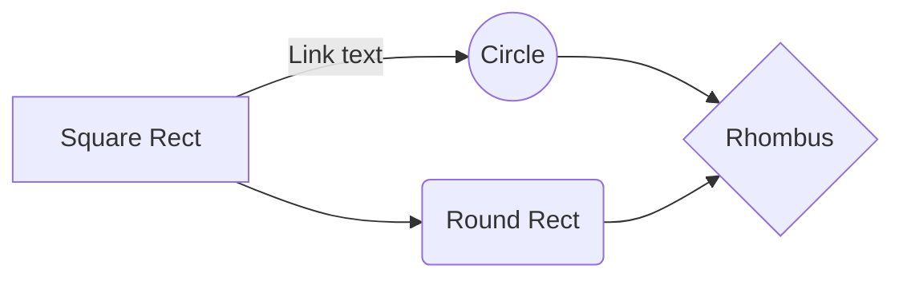

# InsaneDeals - CaseStudy

'InsaneDeals' was an e-commerce project I worked on with Arbor Research. InsaneDeals strives to be the ultimate shopping concierge for prospective customers in a market flooded with different choices.

## Business objectives :
> “We bring the coolest bargains on the Internet to your mobile”.

InsaneDeals wants to create an experience that users will love where they can find amazing deals and get customized deals at all major e-commerce stores. The main target market for them is 'price-obsessed' consumers who want great brands at insane prices, aged 16-30.

## Methodology :

Based on the goals and objectives, 'Personalization' will be the key to the design. And we may further categorize personalization as follows:

- Persona-Based Personalization 
- Personalization Based on the Customer Journey
- Individual-Specific Personalization or Individualization

Now, we'll go through them one by one in the exploration phase.

## Exploration Phase :
### User Personas
I carried out a number of interviews with people from the target audience and discovered three main personas as the first phase of the product design process.

- **Anita** (*University Student - 19yrs*)  
Fashion is her passion, and she wants to stand out in the crowd. As a young adult, she has to save money to buy designer clothes and accessories. Price is a big deal to her.

- **Rahul** (*iOS Developer - 25yrs*) 
He earns an above-average salary. He's super tech-savvy. He always keeps up on the latest technology products. He surfs dozens of sites, looking for the best deals, before finalizing a purchase.

- **Riya** (*Sales Head - 30yrs*) 
She isn’t particularly tech-savvy but uses the internet quite often. She mostly buys online to save time. She mostly looks out for classic and well-known brands for her shopping choices.
 

### User Journey maps
When a project revolves around e-commerce, user experience research must focus on the journey, the customers take in preparing for, during, and after their online shopping experience. But here in this experience, we will be more focusing on the discovery/searching phase. As our product is here to help the user make a decision for their purchase. Based on the personas, I mapped out their hypothetical experiences through user journeys.

And here are the key takeaways from the User journey maps.

- I was able to identify and highlight the user problems.  
- I understood how they interacted with similar platforms  
- I got to know what they expect from a similar platform.  
- I discovered some of their pain points and found out what they experienced at different stages of the shopping experience.  
- I compiled some ideas for solving some of the issues.

### Individualization
Even though personas and journey maps helped us reach the goal of personalization, they were all still focused on delivering content to a broad segment of users. If we want to provide tailored deals/offers based on customer's preferences, we can't just bucket them into such broad segments. Therefore, we must go for Individualization, a process that will truly personalize customer experiences in a manner that meets specific consumer expectations by simply personalizing to a single segment.
>But how can we do that?

## Design Solutions

After collecting all the insights from the exploration phase, I began designing the platform. I started with as basic as paper sketches, to interactive prototypes in this process.

## Rename a file

You can rename the current file by clicking the file name in the navigation bar or by clicking the **Rename** button in the file explorer.

## Delete a file

You can delete the current file by clicking the **Remove** button in the file explorer. The file will be moved into the **Trash** folder and automatically deleted after 7 days of inactivity.

## Export a file

You can export the current file by clicking **Export to disk** in the menu. You can choose to export the file as plain Markdown, as HTML using a Handlebars template or as a PDF.

# Synchronization

Synchronization is one of the biggest features of StackEdit. It enables you to synchronize any file in your workspace with other files stored in your **Google Drive**, your **Dropbox** and your **GitHub** accounts. This allows you to keep writing on other devices, collaborate with people you share the file with, integrate easily into your workflow... The synchronization mechanism takes place every minute in the background, downloading, merging, and uploading file modifications.

There are two types of synchronization and they can complement each other:

- The workspace synchronization will sync all your files, folders and settings automatically. This will allow you to fetch your workspace on any other device.
	> To start syncing your workspace, just sign in with Google in the menu.

- The file synchronization will keep one file of the workspace synced with one or multiple files in **Google Drive**, **Dropbox** or **GitHub**.
	> Before starting to sync files, you must link an account in the **Synchronize** sub-menu.

## Open a file

You can open a file from **Google Drive**, **Dropbox** or **GitHub** by opening the **Synchronize** sub-menu and clicking **Open from**. Once opened in the workspace, any modification in the file will be automatically synced.

## Save a file

You can save any file of the workspace to **Google Drive**, **Dropbox** or **GitHub** by opening the **Synchronize** sub-menu and clicking **Save on**. Even if a file in the workspace is already synced, you can save it to another location. StackEdit can sync one file with multiple locations and accounts.

## Synchronize a file

Once your file is linked to a synchronized location, StackEdit will periodically synchronize it by downloading/uploading any modification. A merge will be performed if necessary and conflicts will be resolved.

If you just have modified your file and you want to force syncing, click the **Synchronize now** button in the navigation bar.

> **Note:** The **Synchronize now** button is disabled if you have no file to synchronize.

## Manage file synchronization

Since one file can be synced with multiple locations, you can list and manage synchronized locations by clicking **File synchronization** in the **Synchronize** sub-menu. This allows you to list and remove synchronized locations that are linked to your file.

# Publication

Publishing in StackEdit makes it simple for you to publish online your files. Once you're happy with a file, you can publish it to different hosting platforms like **Blogger**, **Dropbox**, **Gist**, **GitHub**, **Google Drive**, **WordPress** and **Zendesk**. With [Handlebars templates](http://handlebarsjs.com/), you have full control over what you export.

> Before starting to publish, you must link an account in the **Publish** sub-menu.

## Publish a File

You can publish your file by opening the **Publish** sub-menu and by clicking **Publish to**. For some locations, you can choose between the following formats:

- Markdown: publish the Markdown text on a website that can interpret it (**GitHub** for instance),
- HTML: publish the file converted to HTML via a Handlebars template (on a blog for example).

## Update a publication

After publishing, StackEdit keeps your file linked to that publication which makes it easy for you to re-publish it. Once you have modified your file and you want to update your publication, click on the **Publish now** button in the navigation bar.

> **Note:** The **Publish now** button is disabled if your file has not been published yet.

## Manage file publication

Since one file can be published to multiple locations, you can list and manage publish locations by clicking **File publication** in the **Publish** sub-menu. This allows you to list and remove publication locations that are linked to your file.

# Markdown extensions

StackEdit extends the standard Markdown syntax by adding extra **Markdown extensions**, providing you with some nice features.

> **ProTip:** You can disable any **Markdown extension** in the **File properties** dialog.

## SmartyPants

SmartyPants converts ASCII punctuation characters into "smart" typographic punctuation HTML entities. For example:

|                |ASCII                          |HTML                         |
|----------------|-------------------------------|-----------------------------|
|Single backticks|`'Isn't this fun?'`            |'Isn't this fun?'            |
|Quotes          |`"Isn't this fun?"`            |"Isn't this fun?"            |
|Dashes          |`-- is en-dash, --- is em-dash`|-- is en-dash, --- is em-dash|

## KaTeX

You can render LaTeX mathematical expressions using [KaTeX](https://khan.github.io/KaTeX/):

The *Gamma function* satisfying $\Gamma(n) = (n-1)!\quad\forall n\in\mathbb N$ is via the Euler integral

$$
\Gamma(z) = \int_0^\infty t^{z-1}e^{-t}dt\,.
$$

> You can find more information about **LaTeX** mathematical expressions [here](http://meta.math.stackexchange.com/questions/5020/mathjax-basic-tutorial-and-quick-reference).

## UML diagrams

You can render UML diagrams using [Mermaid](https://mermaidjs.github.io/). For example, this will produce a sequence diagram:

And this will produce a flow chart:

